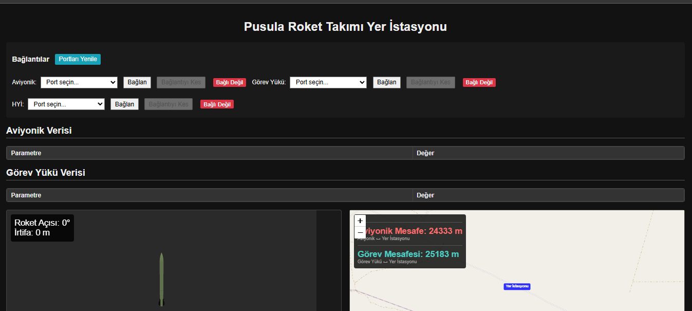

# Pusula Roket Takımı — Aviyonik ve Yer İstasyonu Sistemi

TEKNOFEST Roket Yarışması **Lise Kategorisi**'nde geliştirilen model roket aviyonik kartı ve yer istasyonu yazılımlarını içerir. Sistem, uçuş boyunca irtifa ve konum verilerini toplar, LoRa üzerinden yere aktarır ve yer istasyonunda harita ile üç boyutlu roket modeli üzerinde canlı olarak görselleştirir.

> 2025 TEKNOFEST Roket Yarışması Lise Kategorisi — **Türkiye 3.'sü**

---

## İçindekiler

- [Sistem mimarisi](#sistem-mimarisi)
- [Donanım](#donanım)
- [Aviyonik yazılımı](#aviyonik-yazılımı)
- [Telemetri paketi](#telemetri-paketi)
- [Yer istasyonu](#yer-istasyonu)
- [Kurulum ve çalıştırma](#kurulum-ve-çalıştırma)
- [Depo yapısı](#depo-yapısı)

---

## Sistem mimarisi

Sistem, roket üzerindeki iki bağımsız birim ile yerdeki istasyondan oluşur:

**Aviyonik birimi** roket gövdesi içinde konumlanır. Sensörlerden gelen ölçümleri belirli aralıklarla okur, uçuş algoritmasını çalıştırır ve telemetri paketini LoRa üzerinden yere gönderir.

**Görev yükü** ayrılma sonrası kendi telemetrisini bağımsız olarak yayınlar ve yer istasyonunda ayrı bir bağlantı olarak izlenir.

**Yer istasyonu** operatör bilgisayarında çalışır. Aviyonik, görev yükü ve hakem yer istasyonu (HYİ) bağlantılarını eş zamanlı yönetir; gelen paketleri çözer, doğrular ve tarayıcı arayüzünde görselleştirir.

```
    ROKET                                     YER
 ┌──────────────────────┐              ┌──────────────────────┐
 │  BMP280   (irtifa)   │              │   LoRa E22-900T22D   │
 │  NEO-7M   (konum)    │              │          │           │
 │      │               │              │      USB-TTL         │
 │  Deneyap Kart        │  ─────────►  │          │           │
 │      │               │    LoRa      │   Yer istasyonu      │
 │  LoRa E22-900T22D    │              │  (HTML/CSS/JS)       │
 └──────────────────────┘              │                      │
 ┌──────────────────────┐              │  Aviyonik            │
 │  Görev yükü          │  ─────────►  │  Görev yükü          │
 └──────────────────────┘              │  HYİ                 │
                                       └──────────────────────┘
```

---

## Donanım

| Bileşen | Model | Görevi |
| --- | --- | --- |
| İşlemci kartı | Deneyap Kart (ESP32) | Sensör okuma, uçuş algoritması, telemetri |
| Barometre | BMP280 | Basınç ve barometrik irtifa ölçümü |
| GNSS alıcısı | u-blox NEO-7M | Enlem, boylam, GPS irtifası |
| Telemetri | EBYTE E22-900T22D (LoRa) | Roket ile yer arasında kablosuz bağlantı |
| Arayüz | USB-TTL dönüştürücü | Yer tarafındaki LoRa modülünün bilgisayara bağlanması |

**Bağlantı özeti**

BMP280 kart üzerindeki I²C hattına bağlanır. NEO-7M modülü UART üzerinden NMEA cümleleri yayınlar. E22-900T22D modülü ayrı bir UART hattına bağlanır; modülün M0 ve M1 pinleri çalışma kipini belirlediğinden bunlar sabit seviyeye çekilir ya da GPIO üzerinden sürülür.

> Modüllerin bağlandığı pin numaraları kaynak dosyanın başında tanımlıdır ve donanıma göre güncellenmelidir.

---

## Aviyonik yazılımı

Aviyonik yazılımı, Arduino çatısı altında C++ ile yazılmıştır ve şu adımları döngü halinde yürütür:

1. **Sensör okuma** — BMP280'den basınç ve sıcaklık, NEO-7M'den konum bilgisi alınır. Barometrik irtifa, kalkış öncesinde alınan referans basınca göre hesaplanır; böylece deniz seviyesi yerine yerden yükseklik elde edilir.
2. **Uçuş durumu takibi** — Ölçümlere göre roketin hangi uçuş aşamasında olduğu belirlenir: rampada bekleme, motor yanışı, serbest yükseliş, tepe noktası ve iniş.
3. **Telemetri gönderimi** — Hazırlanan paket LoRa modülüne yazılır ve yer istasyonuna iletilir.

Tepe noktası tespiti tek bir ölçüme dayandırılmaz. Barometrik irtifa doğası gereği gürültülü olduğundan, ölçülen irtifanın o ana kadarki en yüksek değerin altında kalması **ardışık olarak belirli sayıda örnek boyunca** sürerse alçalma kabul edilir. Bu yaklaşım, yükseliş sırasındaki anlık dalgalanmaların yanlış karar üretmesini engeller.

---

## Telemetri paketi

Aviyonik birimi, uçuş verilerini sabit uzunlukta çerçeveler halinde gönderir. Çerçeve yapısı şu bileşenlerden oluşur:

| Alan | Açıklama |
| --- | --- |
| Başlık | Paketin başlangıcını işaretler; alıcı çerçeveyi bu bayta göre hizalar |
| Sayaç | Paket numarası, kayıp paketlerin tespiti için |
| Veri alanı | İrtifa, basınç, enlem, boylam ve uçuş durumu |
| Sağlama toplamı | Veri alanı baytlarının toplamının 256 modu |
| Sonlandırıcı | Çerçevenin bittiğini bildirir |

Yer istasyonu, gelen bayt akışını çerçevelere ayırırken önce başlık baytını arar, ardından beklenen uzunluk kadar bayt toplar ve son olarak sağlama toplamını doğrular. Doğrulamayı geçemeyen paketler işlenmeden atılır; kablosuz hatta bozulan bir çerçevenin ekrana hatalı veri düşürmesi bu şekilde önlenir.

> Alan uzunlukları ve bayt sıralaması `docs/` altındaki protokol tanımında ayrıntılı olarak verilmiştir.

---

## Yer istasyonu

Yer istasyonu, HTML, CSS ve JavaScript ile geliştirilmiş tarayıcı tabanlı bir arayüzdür.



### Bağlantı yönetimi

Arayüz üç ayrı seri bağlantıyı bağımsız olarak yönetir: **aviyonik**, **görev yükü** ve **hakem yer istasyonu (HYİ)**. Her bağlantı için port seçimi, bağlanma ve kesme işlemleri ayrı ayrı yapılır; bağlantı durumu arayüzde anlık olarak gösterilir. Portları yenileme düğmesi, uçuş öncesi donanım takılıp çıkarıldığında listeyi günceller.

### Veri panelleri

Aviyonik ve görev yükü verileri ayrı tablolarda parametre-değer biçiminde listelenir. Böylece iki birimin telemetrisi karşılaştırmalı olarak izlenebilir.

### Üç boyutlu roket modeli

Roketin o anki yönelimi üç boyutlu model üzerinde canlandırılır; model, telemetriden gelen açı verisiyle gerçek zamanlı olarak döndürülür. Panelin köşesinde roket açısı ve anlık irtifa sayısal olarak gösterilir.

### Harita ve mesafe takibi

GPS'ten gelen enlem ve boylam bilgisi harita üzerinde işaretlenir. Yer istasyonu konumu referans alınarak aviyonik ve görev yükünün istasyona olan mesafeleri ayrı ayrı hesaplanıp gösterilir. İniş sonrası her iki birimin bulunması bu bileşen üzerinden yapılır.

---

## Kurulum ve çalıştırma

### Aviyonik

Kaynak dosya Arduino IDE ile derlenir. Öncesinde Deneyap Kart desteğinin kart yöneticisine eklenmiş olması ve kullanılan sensör kütüphanelerinin kurulmuş olması gerekir. Kart seçildikten sonra kod doğrudan yüklenebilir.

Yükleme öncesinde kaynak dosyanın başındaki pin tanımları ve eşik değerleri kullanılan donanıma göre gözden geçirilmelidir.

### Yer istasyonu

Yer tarafındaki LoRa modülleri USB-TTL dönüştürücüler üzerinden bilgisayara bağlanır. Arayüz açıldıktan sonra her bağlantı için ilgili seri port seçilerek bağlantı kurulur.

Tarayıcının seri porta erişebilmesi için Web Serial API destekleyen bir tarayıcı (Chrome veya Edge) kullanılmalıdır. Seri port erişimi güvenlik gereği yalnızca `https://` veya `localhost` üzerinden çalıştığından, arayüz dosyası doğrudan açılmak yerine yerel bir sunucu üzerinden servis edilmelidir.

---

## Depo yapısı

```
├── aviyonik/        Aviyonik kartı kaynak kodu
├── hyi/  Yer istasyonu arayüzü
├── docs/            Protokol tanımı, teknik dokümanlar ve görseller
└── README.md
```

---

## Katkı ve iletişim

Depo, yarışmaya hazırlanan diğer takımların incelemesi ve kendi sistemlerini geliştirirken referans alması amacıyla açık kaynak olarak paylaşılmıştır. Soru ve önerileriniz için issue açabilirsiniz.
